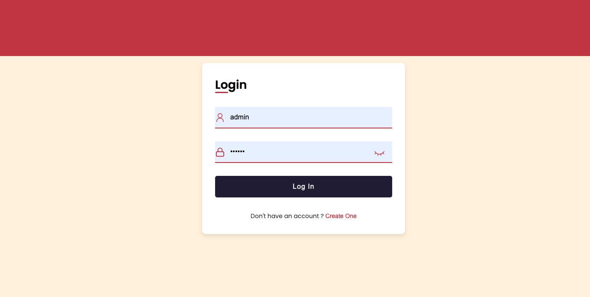
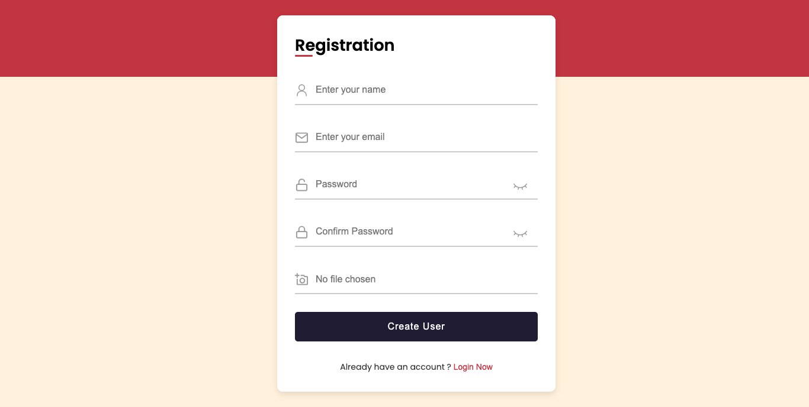
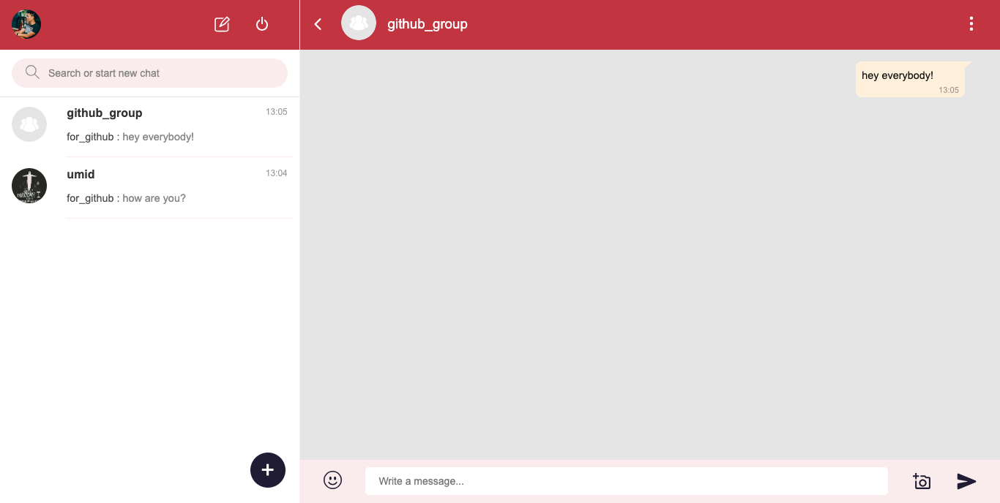
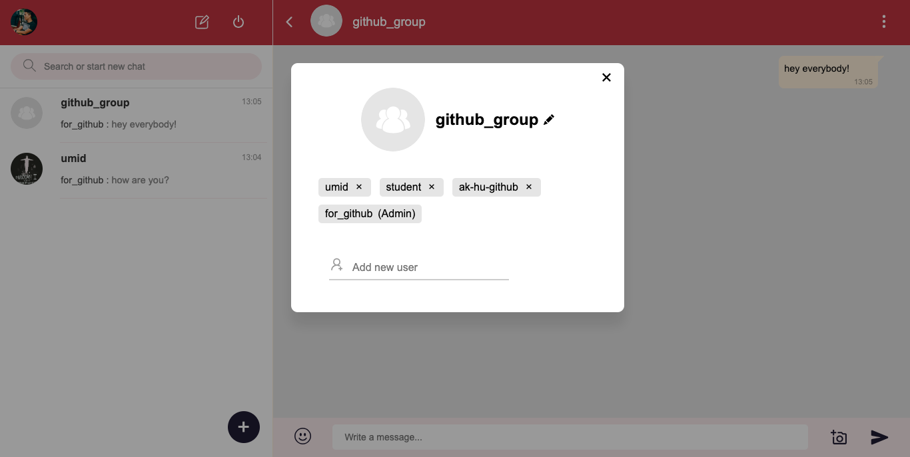
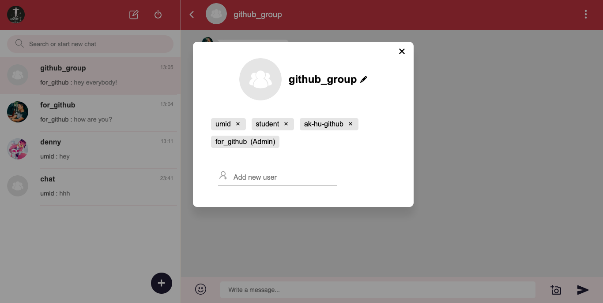
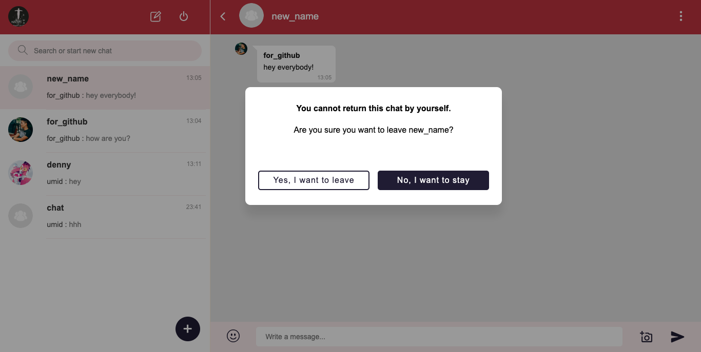

# Advanced Chat Application

It is a real-time application built using the MERN stack. It provides users with a seamless and interactive chatting experience.

## Features

- Real-time Messaging: Users can chat with each other in real time, sending and receiving messages instantly without the need to refresh the page.

- User Authentication: The application supports user registration and authentication, ensuring secure access to the chat functionality.

- Group Chats: Users can create or join group chats, allowing them to communicate with multiple participants simultaneously.

- Message History: The application keeps a history of previous messages, allowing users to view their chat history and scroll through past conversations.

- Emojis and Media Sharing: Users can enhance their conversations by sending emojis and sharing media files such as images or videos.

## Technologies Used

The project is built using the MERN stack, which consists of the following technologies:

- MongoDB: A NoSQL database used to store and manage user information, chat messages, and other relevant data.

- Express.js: A web application framework for Node.js that handles server-side logic and API routes.

- React: A JavaScript library for building user interfaces, used to create the client-side of the application.

- Node.js: A JavaScript runtime environment used for server-side development and running the Express.js server.

- Socket.IO: A library that enables real-time, bidirectional communication between the server and the clients, facilitating instant messaging.

- SCSS: A CSS preprocessor that provides additional features and enhancements to standard CSS, such as variables, nesting, and modular organization.

## Usage

To use the Chat App MERN, follow these steps:

1. Clone the repository: `git clone https://github.com/ak-hu/chat-app-mern.git`
2. Navigate to the project directory: `cd chat-app-mern`
3. Install the dependencies: `npm install`
4. Set up the environment variables:
   - Create a `.env` file in the root directory.
   - Specify the required environment variables (e.g., MongoDB connection URI, JWT secret key).
5. Start the development server: `npm start`
6. Access the application in your web browser at `http://localhost:3000`.

## Screenshots

<h3 align="center">Login Page</h3>

*Login page with Login component*

*Login page with Register component*

<h3 align="center">Chat Page</h3>

*Chat page with Contacts, SingleChat and ChatInput components*

*Chat page with UpdateProfile component*

*Chat page with GroupchatCreate component*

*Chat page with GroupchatUpdate component*

*Chat page with SubmitModal component*

## Contributing

Contributions to the Chat App MERN project are welcome! If you have any ideas for improvements, bug fixes, or new features, feel free to open an issue or submit a pull request.

Please make sure to follow the existing coding style and guidelines when contributing.

## License

This project is currently without a specific license. All rights are reserved.
"# chat_app" 
"# chat_app" 
